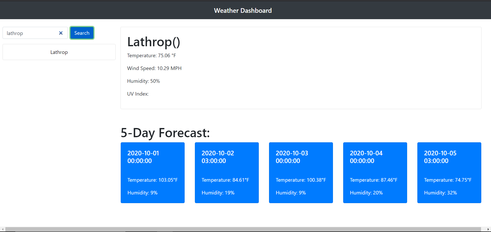

# Day Planner

In this project i was able to create a weather dashbaord from scratch with multiple features like a search function, a 5 day weather forecast, and a saved city history.

## Image of the Website

## Built With

* [HTML](https://developer.mozilla.org/en-US/docs/Web/HTML)
* [BOOTSTRAP](https://getbootstrap.com/)
* [JQUERY](https://jquery.com/)

## Code Snippet
   The code below was used to create the 5 day future forecast cards which contain info passed through from jquery using ajax

    

        

            <h5 class="card-title" id="date1"></h5>
             
            
Temperature: °F

            
Humidity: %

        

    

## DEPLOYED WEBSITE LINKS

* [Weather Dashboard Website](https://gabrielpineda808.github.io/weather-app/)
* [Weather Dashboard Gitub Repo](https://github.com/GabrielPineda808/weather-app/)

## Authors

* **Gabriel Pineda** 

- [Link to Github](https://github.com/GabrielPineda808)
- [Link to LinkedIn](https://www.linkedin.com/in/gabriel-pineda-a94535195/)